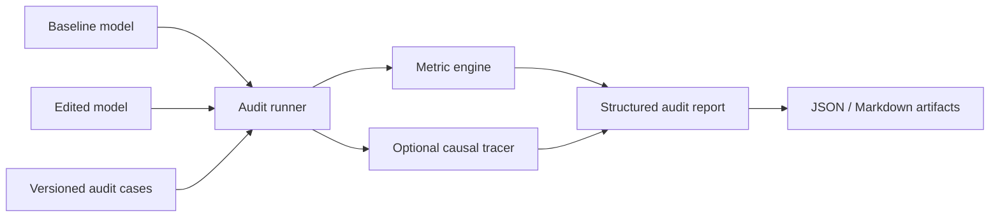

# KEditAudit

> An audit-first toolkit for measuring the observable effects of knowledge edits in language models.

KEditAudit compares a baseline model with an edited model and produces a reproducible audit artifact. It focuses on what changed, what remained stable, and which claims the available evidence can or cannot support.

This repository is currently a reviewed project blueprint and early Python
package. It does **not** yet implement ROME, MEMIT, broad model-family support,
or a safety certification system.

## Why this project

Knowledge-editing methods can change a target fact without full retraining, but edit success alone does not establish that the edit generalizes correctly or leaves unrelated behavior intact. Existing frameworks already implement many editing algorithms. KEditAudit therefore starts with the narrower missing layer: editor-agnostic, versioned, deterministic audit reports.

## First usable release

Version `0.1` should accept:

- a baseline model adapter;
- an edited model adapter or editor-produced checkpoint;
- a versioned audit-case file containing target, paraphrase, neighborhood, portability, and control probes;
- an explicit metric configuration and random seed.

It should produce:

- `audit-report.json`, validated against a published schema;
- `audit-report.md`, derived only from the structured results;
- raw per-probe scores and provenance;
- a deterministic run manifest containing model revision, tokenizer revision, package versions, device, dtype, seed, and dataset revision.

## Scope

KEditAudit will initially provide:

1. schemas and artifact validation;
2. efficacy, generality, locality, portability, and distribution-drift metrics;
3. deterministic causal-tracing experiments on a tiny supported model;
4. adapters for external editor outputs, beginning with the official ROME code and EasyEdit;
5. CLI and Markdown/JSON reporting.

It will not initially:

- claim to prove model safety or alignment;
- support arbitrary Hugging Face architectures;
- generate or distribute edited production weights;
- download large models during unit tests;
- use an LLM to determine PASS/FAIL results.

## Planned architecture



See:

- [Project brief](docs/PROJECT_BRIEF.md)
- [Knowledge base](docs/KNOWLEDGE_BASE.md)
- [Architecture](docs/ARCHITECTURE.md)
- [AuditCase contract](docs/AUDIT_CASE.md)
- [RunManifest and artifact hashing](docs/RUN_MANIFEST.md)
- [MetricResult and AuditReport contracts](docs/AUDIT_REPORT.md)
- [ModelAdapter contract and offline fake](docs/MODEL_ADAPTER.md)
- [Causal-tracing primitives](docs/CAUSAL_TRACING.md)
- [Implemented metric definitions](docs/METRICS.md)
- [Roadmap](docs/ROADMAP.md)
- [Review of the Gemini draft](docs/GEMINI_REVIEW.md)
- [Codex for OSS application draft](docs/OSS_APPLICATION_DRAFT.md)
- [Name, license, and citation decision](docs/NAME_AND_CITATION.md)

## Development status

The package currently implements versioned `AuditCase`, `RunManifest`,
`MetricResult`, and `AuditReport` JSON Schemas, offline validation APIs,
deterministic artifact hashing, and target sequence log-probability from
supplied logits. It also implements coverage-aware generality and locality
reductions over paired probe scores. A deterministic `ModelAdapter` protocol,
offline fake, and a pinned CPU/float32 `GPT2LMHeadModel` scoring adapter are
available, together with safe module resolution, hook lifecycle management,
an offline clean/corrupt/restore coordinator, and a pinned GPT-2 activation
adapter. The GPT-2 integration adds deterministic subject-embedding noise,
restores clean subject states at verified transformer blocks, and emits ordered
JSON-ready heatmap evidence. Report generation, Markdown rendering, other
metric reducers, the CLI, and external editor adapters remain planned work.

```powershell
python -m pip install -e ".[dev]"
python -m pytest
```

The optional local GPT-2 integration uses exact ML versions and no downloaded
checkpoint:

```powershell
python -m pip install -e ".[dev,ml]"
python -m pytest -m integration tests/integration/test_transformers_gpt2_adapter.py
```

## Citation

The repository includes [`CITATION.cff`](CITATION.cff) for GitHub and archival
tools. Until the first DOI-backed release, cite the exact repository revision
used. Do not cite planned functionality as an implemented experimental result.

## License

KEditAudit is licensed under the [Apache License 2.0](LICENSE).
